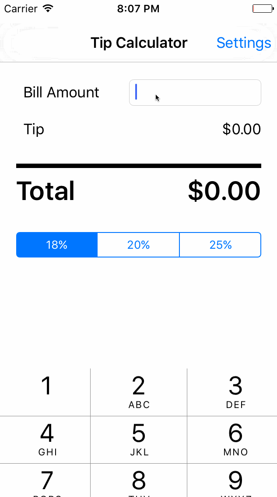

# TipCalculator

Author: Tianyi Xing (xingtianyi@gmail.com)

This is a Tip Calculator application for iOS submitted as the [pre-assignment](https://gist.github.com/timothy1ee/7747214) requirement for CodePath.

Time spent: [2 hours]

Completed:

* [X] Required: User can enter a bill amount, choose a tip percentage, and see the tip and total values.
* [X] Required: Settings page to change the default tip percentage.
* [X] Optional: UI animations

Video Demo:

 

 
